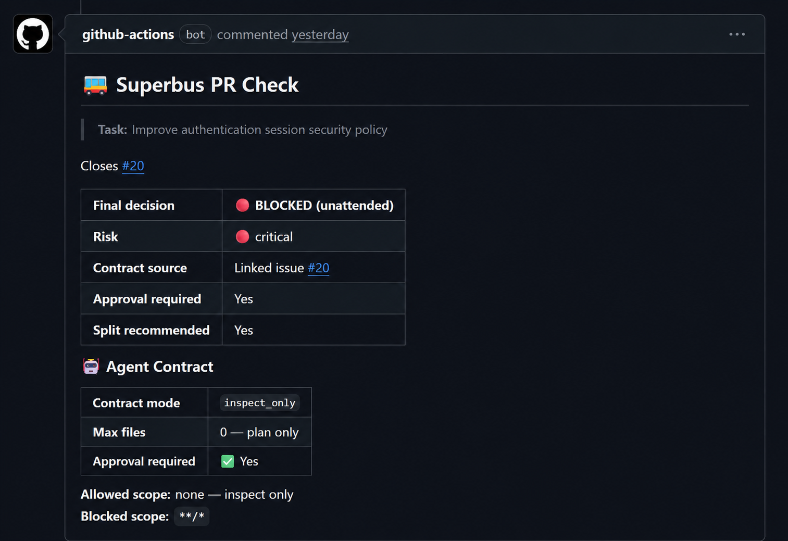

# Superbus Contract Action

No AI PR without a contract.

A GitHub Action that checks whether PR changed files stayed inside an Agent Contract.



<p align="center"><sub>Superbus checks PR changed-file paths against an Agent Contract and comments when the PR goes out of bounds.</sub></p>

## Install In 2 Files

### 1. Add `.superbus/agent-contract.json`

```json
{
  "schema_version": 1,
  "allowed_scope": ["src/settings/locale.ts", "tests/settings.test.ts"],
  "blocked_scope": ["src/payments/**", "src/auth/**", ".github/**"],
  "max_files": 2
}
```

### 2. Add `.github/workflows/superbus-contract-check.yml`

```yaml
name: Superbus Contract Check

on:
  pull_request:
    types: [opened, synchronize, reopened, edited]

permissions:
  contents: read
  pull-requests: write

jobs:
  contract-check:
    runs-on: ubuntu-latest
    steps:
      - uses: actions/checkout@v4

      - uses: techarrow12/superbus-contract-action@v0.1.0
        with:
          github-token: ${{ secrets.GITHUB_TOKEN }}
```

Open a PR. Superbus will post one contract check comment.

## What Happens On A PR

- `Within Contract`: every changed file matched `allowed_scope`.
- `Contract Violated`: a changed file matched `blocked_scope`, was outside `allowed_scope`, or exceeded `max_files`.
- Observe mode is the default: the action comments but does not fail CI.
- Enforce mode is one line:

```yaml
fail-on-violation: "true"
```

## Why

AI coding agents are fast, but a narrow prompt can accidentally touch protected application code, tests, configs, and CI files.

Superbus separates scope review from code review:

```text
Contract file -> PR changed files -> scope check -> comment/fail CI
```

The open-source action checks contracts. It does not generate them.

## Example Contract

```json
{
  "schema_version": 1,
  "mode": "write_allowed",
  "allowed_scope": ["docs/**", "README.md"],
  "blocked_scope": ["src/**", ".github/workflows/**"],
  "max_files": 3
}
```

See [the contract schema](docs/contract-schema.md) for the TypeScript type, field reference, and glob examples.

Contract `mode` defaults to `write_allowed`. Use `inspect_only` or `approval_required` when a PR should not merge until the contract is changed or explicitly approved.

## Common Examples

### Docs Only

```json
{
  "schema_version": 1,
  "allowed_scope": ["README.md", "docs/**"],
  "blocked_scope": ["src/**", ".github/**"],
  "max_files": 3
}
```

### Feature-Safe

```json
{
  "schema_version": 1,
  "allowed_scope": ["src/settings/locale.ts", "tests/settings.test.ts"],
  "blocked_scope": ["src/payments/**", "src/auth/**", "src/db/**", ".github/**"],
  "max_files": 2
}
```

### Auth Blocked

```json
{
  "schema_version": 1,
  "allowed_scope": ["src/profile/**", "tests/profile.test.ts"],
  "blocked_scope": ["src/auth/**", "src/payments/**"],
  "max_files": 4
}
```

More recipes are in [docs/examples.md](docs/examples.md).

## Inputs

| Input | Default | Description |
|---|---:|---|
| `github-token` | `${{ github.token }}` | Token used to fetch PR changed files and post comments. Pass `${{ secrets.GITHUB_TOKEN }}` in workflows. |
| `contract-path` | `.superbus/agent-contract.json` | Path to an Agent Contract JSON file. |
| `contract-json` | | Inline Agent Contract JSON. Use this instead of a custom `contract-path`. |
| `post-comment` | `true` | Post the contract check result on the PR. |
| `fail-on-violation` | `false` | Fail CI when the contract is violated. |
| `update-comment` | `true` | Update the existing Superbus comment instead of posting duplicates. |

## Outputs

| Output | Description |
|---|---|
| `compliance_status` | `within_contract`, `violated_contract`, or `not_applicable`. |
| `changed_file_count` | Number of PR changed files checked. |
| `violation_count` | Number of contract violations found. |
| `contract_violated` | `true` when the PR violated the Agent Contract. |
| `comment_url` | URL of the PR comment when one was posted. |

## Privacy

Superbus Contract Action fetches changed file paths only.

It does not:

- fetch source file contents
- inspect diffs
- scan repository source
- upload source code
- call external APIs other than GitHub

If you do not want PR comments, set `post-comment: "false"`. The action will still set outputs and can still fail CI when `fail-on-violation: "true"`.

## Contract Authoring

Superbus Contract Action checks contracts that you provide.

Write the contract by hand, generate it in your own workflow, or pass it through `contract-json`. The action does not need access to source contents to run the check.

## Limitations

- v1 checks supplied contracts only.
- v1 does not generate contracts.
- v1 checks file paths, not runtime behavior.
- v1 does not detect every unsafe AI code change.
- v1 does not replace human review.

## Development

```bash
pnpm install
pnpm typecheck
pnpm test
pnpm build
```
